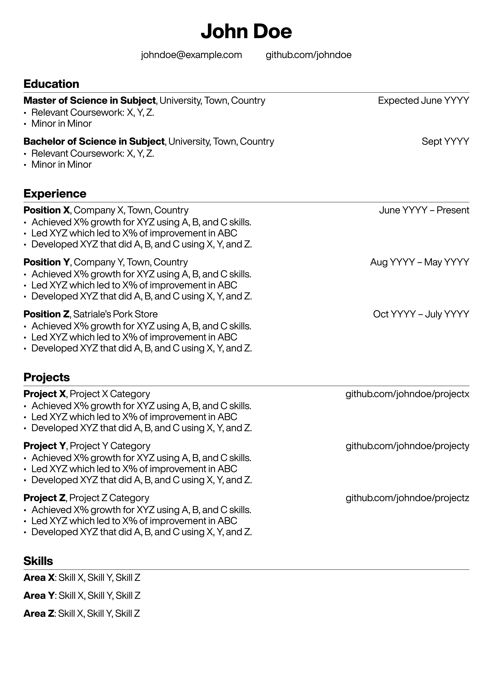

# `resume.rs`

> It's not about the resume of the man, but about the man in the resume.

A standalone templating resume generator written in Rust.

| Input `yaml`                | Output `pdf`                 |
| --------------------------- | ---------------------------- |
|   |  |

Looks for a [`resume.yaml`](./resume.yaml) file and generates both [`resume.tex`](./resume.tex) and [`resume.pdf`](./resume.pdf).

The generated [`resume.tex`](./resume.tex) is human-readable and can serve for further customizations.

## Usage

```bash
./resume.rs
```

This is equivalent to
```bash
./resume.rs pdf resume.yaml
```

To only generate tex
```bash
./resume.rs tex resume.yaml
```

## Installation

Since this program uses the experimental `cargo-script` feature, only making it executable is required:
```bash
chmod +x resume.rs
```

## Dependencies

Only uses `cargo`. You might need to install the nightly toolchain.

## Notes

The `yaml` schema is by all means not yet ratified.

It might be faster to use a system-wide installation of `tectonic` after generating the `tex`, maybe even setting up a file watcher.

Might implement a file-change-listener that automatically compiles the `yaml` on saving.

## Demo


